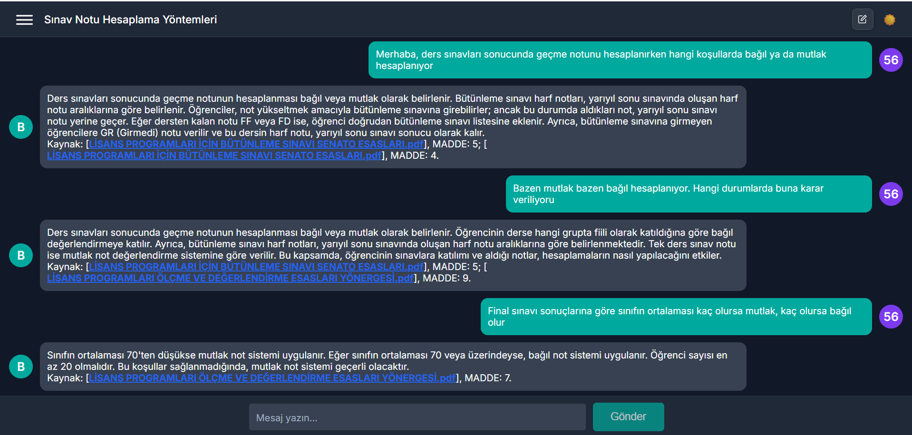

# BTU-LangChain-RAG: LangChain Tabanlı Çok Ajanlı RAG Chatbot Sistemi

**BTU-CHATBOT: LANGCHAIN TABANLI ÇOK AJANLI RAG CHATBOTU VE DEĞERLENDİRİLMESİ**

Bu repository, Bursa Teknik Üniversitesi Bilgisayar Mühendisliği bölümü bitirme projesi olarak geliştirilmiş **akıllı RAG (Retrieval-Augmented Generation) chatbot** sisteminin kaynak kodlarını içermektedir. Proje, LangChain framework'ü kullanarak PDF dökümanlarından ve web'den bilgi çekerek öğrencilere **AI destekli soru-cevap** deneyimi sunan gelişmiş platformdur.

## Proje Genel Bakış

BTU-LangChain-RAG, **ReAct (Reasoning and Acting) agent pattern** ile PDF dokümanlarından bilgi çeken ve **OpenAI GPT-4o-mini** modeli ile doğal dil yanıtları üreten kapsamlı bir chatbot platformudur. Modern web teknolojileri ile geliştirilmiş olup üç ana bileşenden oluşmaktadır.

### Sistem Mimarisi

**LangChain ReAct Agent** iki ana araç ile çalışır:
- **PDF Arama**: Staj yönergeleri, ders katalogları gibi dokümanlardan MADDE bazlı bilgi bulma
- **Web Arama**: BTU web sitesinde güncel bilgi arama

**Akıllı Agent** şu süreçleri takip eder:
1. **Thought**: Soruyu analiz eder
2. **Action**: Uygun aracı seçer (PDF arama veya web arama)
3. **Action Input**: Araca parametre geçer
4. **Observation**: Sonuçları değerlendirir
5. **Final Answer**: Kaynak belirtili yanıt üretir

## Proje Mimarisi

```
BTU-LangChain-RAG/
├── Front-End/          # React 19 chatbot web arayüzü
├── Back-End/           # FastAPI + LangChain ReAct agent servisi  
├── Metrics/            # RAGAS ile chatbot performans ölçümü
└── README.md          
```

## Bileşenler

### 1. Frontend - React 19 Chatbot Kullanıcı Arayüzü
Modern React framework'ü ile geliştirilmiş, responsive ve kullanıcı dostu chatbot web arayüzü.

**Temel Özellikler:**
- Firebase Authentication ile güvenli kullanıcı yönetimi
- Gerçek zamanlı chatbot sohbet arayüzü
- LangChain agent reasoning sürecini görselleştirme
- Çoklu dil desteği (Türkçe/İngilizce)
- Mobil uyumlu responsive tasarım
- Tema değiştirme (açık/koyu mod)

**[Detaylı dokümantasyon →](Front-End/README.md)**

### 2. Backend - LangChain ReAct Agent API Servisi
FastAPI framework'ü ile geliştirilmiş, **LangChain ReAct agent** backend servisi.

**Temel Özellikler:**
- **LangChain ReAct Pattern** ile akıllı chatbot reasoning
- **OpenAI GPT-4o-mini** entegrasyonu 
- **ChromaDB** vektör veritabanı
- **MADDE bazlı PDF işleme** sistemi
- **Google Custom Search API** entegrasyonu
- **Conversational Memory** ile chatbot sohbet hafızası

**[Detaylı dokümantasyon →](Back-End/README.md)**

### 3. Metrics - RAGAS ile Chatbot Performans Değerlendirme
**RAGAS framework** ile chatbot sisteminin kalitesini ölçmek ve değerlendirmek için geliştirilmiş araçlar.

**Temel Özellikler:**
- **RAGAS 0.1.21** ile AI chatbot yanıt kalitesi ölçümü
- **Context Precision/Recall** metrikleri
- **Faithfulness** ve **Answer Relevancy** analizi
- **Agent Response Quality** değerlendirme
- **Token kullanımı** ve maliyet analizi

**Teknolojiler:** RAGAS 0.1.21, Python 3.8+, Pandas 2.0.3

**[Detaylı dokümantasyon →](Metrics/README.md)**

## Hızlı Başlangıç

### Gereksinimler
- **Node.js** (v16+) - Frontend için
- **React 19.1.0**  - Frontend için
- **python**  - Backend için
- **OpenAI API Key** - GPT-4o-mini için
- **Google API Keys** - Custom Search için
- **Firebase Project** - Authentication için
- **Not**: Back-end ile Metrics için requirements.txt olduğu için oradan kurulum yapabilirsiniz. Front-end ve firebase için gerekli kurulum ve dosyalar gerekli.
  

### Kurulum Adımları

1. **Repository'yi klonlayın:**
```bash
git clone https://github.com/Aytacus/BTU-LangChain-RAG.git
cd BTU-LangChain-RAG
```

2. **Backend'i ayarlayın:**
```bash
cd Back-End
pip install -r requirements.txt
# .env dosyasını oluşturun:
# OPENAI_API_KEY=your_key
# GOOGLE_API_KEY=your_key  
# GOOGLE_CSE_ID=your_cse_id
uvicorn api:app --reload --host 0.0.0.0 --port 8000
```

3. **Frontend'i ayarlayın:**
```bash
cd Front-End
npm install
# Firebase config'i src/firebase/authConfig.js'de güncelleyin
npm start
```

4. **Metrics'i çalıştırın:** (İsteğe bağlı)
```bash
cd Metrics
pip install -r requirements.txt
python evaluate.py
```

## Sistem Akışı

1. **Kullanıcı Girişi:** Frontend üzerinden Firebase Auth ile kimlik doğrulaması
2. **Soru Sorma:** Kullanıcı chatbot arayüzünde soru yazar
3. **LangChain Agent İşleme:** 
   - ReAct agent soruyu analiz eder
   - PDF'lerde MADDE bazlı arama yapar
   - Gerekirse BTU web sitesinde güncel bilgi arar
4. **Yanıt Üretimi:** GPT-4o-mini kaynak belirtili chatbot yanıtı üretir
5. **Sonuç Gösterimi:** Frontend yanıtı kaynak bilgileriyle gösterir

## Teknik Detaylar

### PDF İşleme Sistemi
Dokümanlar **MADDE** numaralarına göre bölünür:
```python
pattern = r"(MADDE\s+\d+.*?)(?=MADDE\s+\d+|$)"
# Her MADDE ayrı chunk olarak ChromaDB'de saklanır
```

### LangChain ReAct Agent Mimarisi
```python
# Agent Tools
@tool
def retrieve(query: str) -> str:
    """PDF dokümanlarında MADDE bazlı arama"""
    
@tool("google_search_univ")  
def google_search_univ(query: str) -> str:
    """BTU web sitesinde güncel bilgi arama"""
```

## Performans Değerlendirme

Chatbot sistem performansı **RAGAS framework** ile ölçülür:
- **Context Recall**: Önemli bilgilerin yakalanması
- **Context Precision**: Bulunan bilgilerin kalitesi  
- **Faithfulness**: Kaynak belgelerle tutarlılık
- **Answer Relevancy**: Yanıtın soruyla uyumu

## Uygulama Görüntüleri

<table style="border: none; border-collapse: collapse;">
<tr style="border: none;">
<td style="border: none; padding: 5px;"></td>
<td style="border: none; padding: 5px;"></td>
</tr>
</table>

<p align="center"><strong>Şekil 1: Homepage Ekranı (Gündüz ve Gece)</strong></p>

<table style="border: none; border-collapse: collapse;">
<tr style="border: none;">
<td style="border: none; padding: 5px;"></td>
<td style="border: none; padding: 5px;"></td>
</tr>
</table>

<p align="center"><strong>Şekil 2: Kayıt Ekranı (Gündüz ve Gece)</strong></p>

<p align="center"></p>

<p align="center"><strong>Şekil 3: Doğrulama Ekranı</strong></p>

<p align="center"></p>

<p align="center"><strong>Şekil 4: Şifre Sıfırlama Ekranı</strong></p>

<table style="border: none; border-collapse: collapse;">
<tr style="border: none;">
<td style="border: none; padding: 5px;"></td>
<td style="border: none; padding: 5px;"></td>
</tr>
</table>

<p align="center"><strong>Şekil 5: Giriş Ekranı (Gündüz ve Gece)</strong></p>

<table style="border: none; border-collapse: collapse;">
<tr style="border: none;">
<td style="border: none; padding: 5px;"></td>
<td style="border: none; padding: 5px;"></td>
<td style="border: none; padding: 5px;"></td>
</tr>
</table>

<p align="center"><strong>Şekil 6: Sohbet Başlığı Güncelleme (Kullanıcı Değiştirmesi)</strong></p>

<table style="border: none; border-collapse: collapse;">
<tr style="border: none;">
<td style="border: none; padding: 5px;"></td>
<td style="border: none; padding: 5px;"></td>
<td style="border: none; padding: 5px;"></td>
</tr>
</table>

<p align="center"><strong>Şekil 7: Sohbet Silme</strong></p>

<p align="center"></p>

<p align="center"><strong>Şekil 8: RAG Yöntemiyle Ulaşılan Dosyalar</strong></p>

<p align="center"></p>

<p align="center"><strong>Şekil 9: Web Searching ile Bulma</strong></p>

## Development

### Local Development
```bash
# Backend (Port 8000)
cd Back-End && uvicorn api:app --reload

# Frontend (Port 3000)  
cd Front-End && npm start

# Metrics evaluation
cd Metrics && python evaluate.py
```

## Özellikler

- **Model**: GPT-4o-mini (maliyet etkin)
- **Framework**: LangChain 0.3.10 ReAct Agent
- **Vektör DB**: ChromaDB (lokal persistence)
- **Chunking**: MADDE bazlı semantik bölme
- **Memory**: Conversational memory
- **Max Iterations**: 15 (agent reasoning)

## Güvenlik

- API anahtarları environment variables'da saklanmalı
- Firebase config maskelenmeli  
- Production'da HTTPS kullanılmalı


## Lisans

Bu proje eğitim amaçlı geliştirilmiştir ve Bursa Teknik Üniversitesi Bilgisayar Mühendisliği bölümü bitirme projesi kapsamındadır.


**GitHub:** [BTU-LangChain-RAG](https://github.com/Aytacus/BTU-LangChain-RAG)

## Technical Stack Özeti

| Bileşen | Frontend | Backend | Metrics |
|---------|----------|---------|---------|
| **Framework** | React 19.1.0 | FastAPI 0.115.6 | Python Scripts |
| **AI/ML** | - | LangChain 0.3.10 + GPT-4o-mini | RAGAS 0.1.21 |
| **Database** | Firebase Firestore | ChromaDB 0.5.23 | File-based |
| **Styling** | Tailwind CSS 4.1.1 | - | - |
| **Deployment** | Vercel |AWS EC2 | Local |
| **Authentication** | Firebase Auth 11.6.0 | - | - |
| **External APIs** | - | Google Custom Search API | - |

---

> **Not:** Bu proje, LangChain ReAct agent sistemi kullanarak PDF dokümanlarından ve web'den bilgi çeken kapsamlı bir RAG chatbot sistemidir. Her bileşenin kendi README dosyası detaylı kurulum talimatları ve kullanım bilgileri içermektedir.
